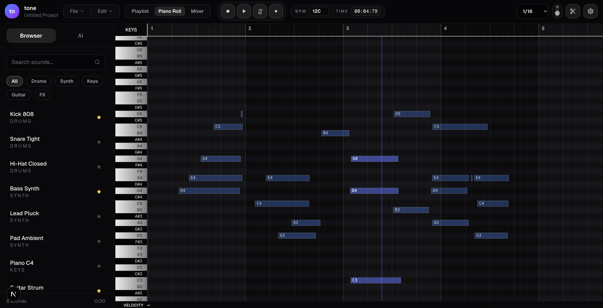

<div align="center">
  
  
  # Tone
  
  **An open source, web-based DAW inspired by FL Studio, Ableton Live, and other professional DAWs**
  
  [](https://opensource.org/licenses/MIT)
  [](https://soniq-audio.com)
  [](https://discord.gg/Y62FaSMP)
  [](https://x.com/soniqaudio_)
  [](https://x.com/rvm0n_)
</div>

---

> **Note:** Tone is still in very early development!

---

## 🎵 What is Tone

Tone is an open source, web-based DAW inspired by FL Studio, Ableton Live, and other DAWs.

### ✨ Features

- **Piano Roll**: A comprehensive and fully featured piano roll, including note edits, velocity, MIDI/computer keyboard, recording, copy/paste/cut and more
- **Playlist**: The arrangement view for your beats and songs, this is where you lay out the individual patterns, audio files and structure your music
- **Mixer**: Here you can manage the volume per track and eventually add various effects like reverb, EQ and more
- **Sound/Drum Presets**: Similar to your DAW, you can use your own drum sounds and synth oneshots and organize them
- **AI Features**: At a later stage Tone will have AI features like oneshot generation, chord progression generation and more built in

## 🎨 What is SoniqAudio

- SoniqAudio is the main brand behind Tone and various other products, generally you can expect about anything in the audio/music/dev/AI space
- The vision is to build an ecosystem around audio and music tools so that different tools can be used from other tools and be interchangeable

## 👥 Who is This For

Music producers, beatmakers, musicians, audio engineers, creatives in the audio/music space, developers, open source enthusiasts

## 🚀 Quick Start

```bash
# Clone the repository
git clone https://github.com/soniqaudio/tone.git

# Install dependencies
pnpm install

# Run the development server
pnpm run dev
```

## 🛠️ Tech Stack and Architecture

- Built with Next.js, TypeScript, Tailwind and Biome
- Web MIDI API and Web Audio API for MIDI/audio functionalities
- Hosted on Vercel
- **(Future)** Backend on Convex, ElevenLabs for AI features, mediabunny for render/export, Mintlify for docs

### 📚 Libraries We Use

- **Tone.js**: General audio processing and features
- **@tonejs/midi**: MIDI keyboard support, recording, MIDI note events, pedal support, ...
- **soundfont-player**: Used for working with existing synth/sound libraries, currently only a realistic piano sound
- **zundo**: Undo/redo functionalities
- **zustand**: Global state management
- **(Soon)** **tonal**: Music theory logic
- **(Soon)** **mediabunny**: For audio rendering/exporting

## 🗺️ Roadmap

*(Last update: 13.11.2025)*

- Extract audio engine and MIDI engine into independent repositories so all future projects can easily integrate them and everything is standardized
- Create good code, architecture and system design documentation
- Build comprehensive mixer components and features
- Build comprehensive playlist components and features
- Build comprehensive music theory features that integrate with MIDI deeply (also in an independent repository)
- Rework the UI/UX and design language
- Implement AI features
- Build a drumkit/sounds folder, syncing with local stored soundkits
- Build comprehensive state management & sync engine
- Build a Convex-based backend for project saving, cloud sync, authentication and more
- Regular code checks, tests and refactoring opportunities

## 🤝 Contributing

Contributions are welcome! This project is in early development, so your feedback, bug reports, and contributions are especially valuable. Feel free to open issues or submit pull requests.

---

<div align="center">
  <strong>Built with ❤️ by <a href="https://soniq-audio.com">SoniqAudio</a></strong>
</div>
