# Architecture Diagrams - Tone DAW

Visual system architecture and data flow diagrams using Mermaid syntax. These diagrams render automatically in GitHub, VS Code (with Mermaid extension), and many markdown viewers.

---

## High-Level System Architecture

### Current Architecture (As-Is)

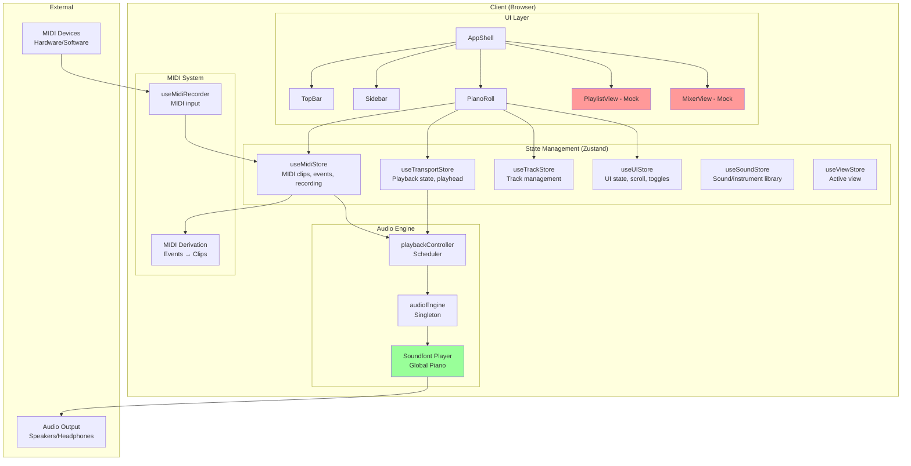

### Target Architecture (To-Be)

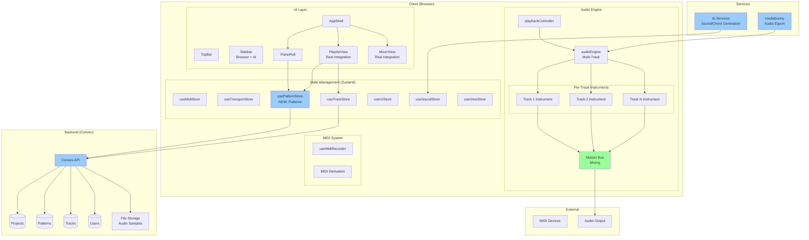

---

## Data Flow Architecture

### MIDI Event Flow (Recording → Playback)

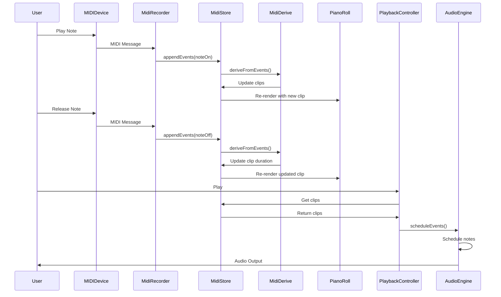

### Pattern System Flow (FL Studio-style)

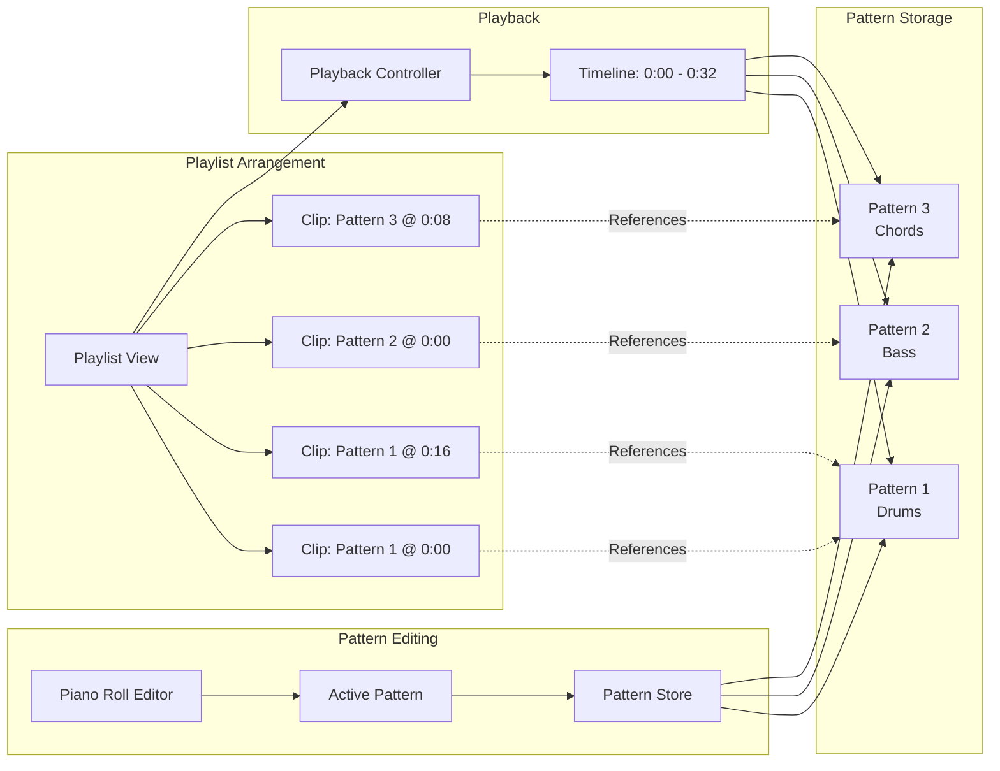

---

## Component Architecture

### Piano Roll Component Structure

```mermaid
graph TB
    subgraph "PianoRoll Component"
        PianoRoll[PianoRoll<br/>Container]
        
        subgraph "Hooks"
            DerivedState[usePianoRollDerivedState<br/>Computed values]
            CanvasSize[useCanvasSize<br/>Viewport dimensions]
            ScrollSync[usePianoRollScrollSync<br/>Scroll management]
            Interactions[usePianoRollInteractions<br/>User interactions]
            KeyboardShortcuts[usePianoRollKeyboardShortcuts<br/>Keyboard handlers]
        end
        
        subgraph "Sub-Components"
            Timeline[Timeline<br/>Time ruler]
            PianoKeys[PianoKeys<br/>Note labels]
            VelocityLane[VelocityLane<br/>Velocity editor]
        end
        
        subgraph "Canvas Layers"
            StaticGrid[StaticGrid<br/>Background grid]
            NotesLayer[NotesLayer<br/>MIDI notes]
            GhostNotesLayer[GhostNotesLayer<br/>Reference notes]
            DynamicOverlay[DynamicOverlay<br/>Playhead, selection]
        end
    end
    
    subgraph "Stores"
        MidiStore[useMidiStore]
        TransportStore[useTransportStore]
        TrackStore[useTrackStore]
        UIStore[useUIStore]
    end
    
    PianoRoll --> DerivedState
    PianoRoll --> CanvasSize
    PianoRoll --> ScrollSync
    PianoRoll --> Interactions
    PianoRoll --> KeyboardShortcuts
    
    PianoRoll --> Timeline
    PianoRoll --> PianoKeys
    PianoRoll --> VelocityLane
    
    PianoRoll --> StaticGrid
    PianoRoll --> NotesLayer
    PianoRoll --> GhostNotesLayer
    PianoRoll --> DynamicOverlay
    
    DerivedState --> MidiStore
    DerivedState --> TransportStore
    DerivedState --> TrackStore
    DerivedState --> UIStore
    
    Interactions --> MidiStore
    Interactions --> TransportStore
```

---

## Audio Pipeline Architecture

### Current Audio Pipeline (Single Track)

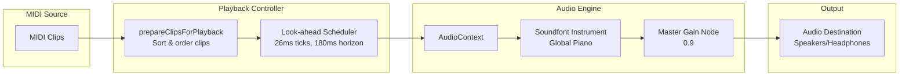

### Target Audio Pipeline (Multi-Track)

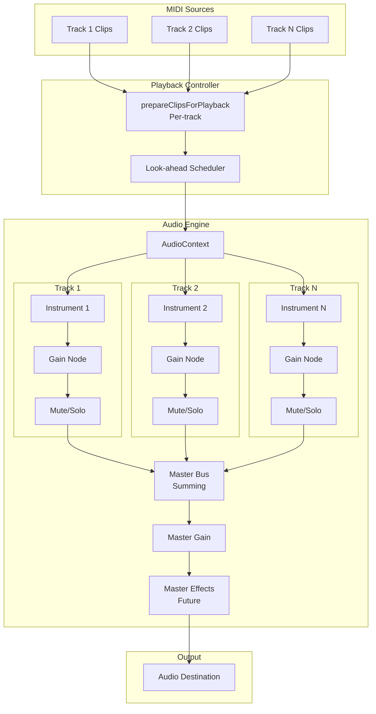

---

## State Management Flow

### Zustand Store Relationships

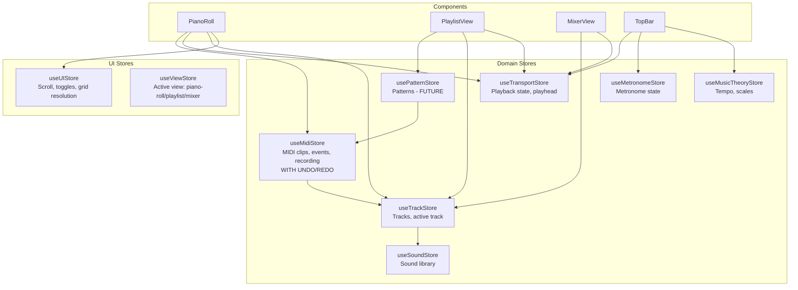

---

## Backend Integration Flow

### Convex Integration Architecture

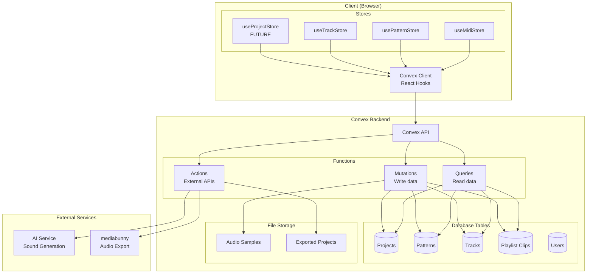

---

## User Interaction Flow

### Note Creation Flow

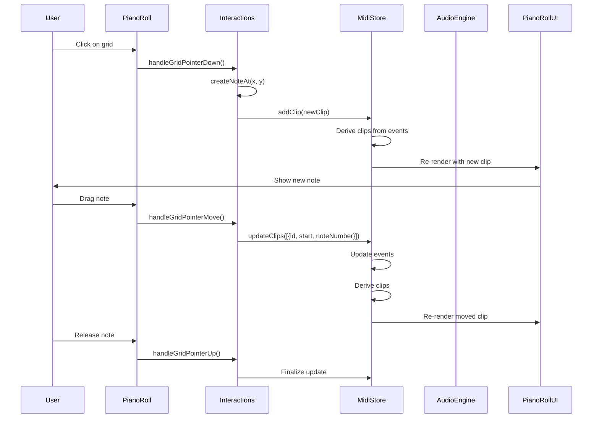

### Recording Flow

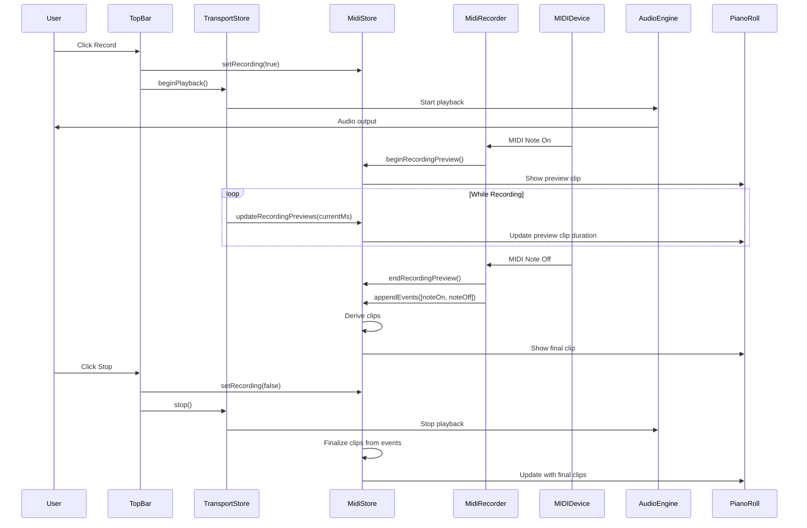

---

## Legend

- **Green boxes**: Implemented and working
- **Red boxes**: Mock/placeholder (not fully implemented)
- **Blue boxes**: Planned/future features
- **Dashed arrows**: References/relationships
- **Solid arrows**: Data flow/function calls

---

## How to View These Diagrams

### VS Code
1. Install "Markdown Preview Mermaid Support" extension
2. Open this file
3. Press `Cmd+Shift+V` (Mac) or `Ctrl+Shift+V` (Windows) to preview

### GitHub
- Diagrams render automatically in markdown files
- View directly in repository

### Online
- Copy Mermaid code blocks to [Mermaid Live Editor](https://mermaid.live/)
- Or use any Mermaid-compatible markdown viewer

---

*Last Updated: Initial architecture diagrams*
*Diagrams use Mermaid syntax - compatible with GitHub, VS Code, and most markdown viewers*

